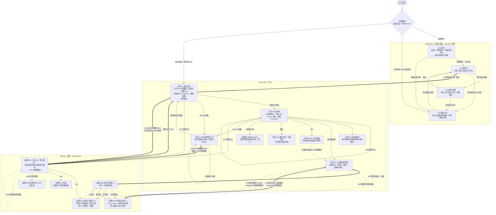

# 整个产品串联产品流 · Helm Whole-Product Flow

> 日期：2026-06-26 · 分支：`integration`（基于 develop） · 产出：项目经理(PM) · 配套：[whole-product-integration.md](./whole-product-integration.md)（接缝/真相源勘察基线） + architecture-wiring.md（接线 HOW，架构师产出）
> 目的：把 **onboarding（首启连主机）/ home-shell（主壳）/ settings（设置）** 三模块的**产品流**串成端到端连贯整体——**无孤岛屏、无死胡同、每条流程有入口有出口、每个跨模块跳转双向可达**，消除"设置这里好使、对话那里不好使"。
> 本文只写 **WHAT（产品流 / 语义 / 真相源归属）**，不写代码符号 / 实现路子（那是架构师 architecture-wiring.md 的事）。能力级表述（"composer 跟随当前中转站""切 host 全产品重载"）可以；实现符号不可。
> 诚实标注：能力缺口（vendor 后端真相源接上、用量 providerUsageList、一键装 agent CLI、删除内置 provider）一律标 **【目标态 / 需新主机能力】**，不假装能用。

---

## 0. 锚点空间消歧（集成必读 · 真实 gotcha）

三模块的 `ui.html` 是**三个不同文件**，锚点会撞名。本文一律按模块限定，**不要跨文件混用**：

| 模块 | ui.html 文件 | 屏锚点空间 | 本文引用写法 |
| --- | --- | --- | --- |
| **onboarding** | canonical `docs/helm/ui.html` 的 onboarding 屏 + develop 落地阶段 | 阶段名（欢迎 / 连接中 / 连接方式 / 错误） | `onb-欢迎` / `onb-连接中` / `onb-连接方式` / `onb-错误`（避免与主壳 s1–s5 撞名） |
| **home-shell 主壳** | `requirements/2026-06-25-home-shell/ui.html` | `s1`–`s15` | `主壳#s1` … `主壳#s15` |
| **settings 设置** | `requirements/2026-06-26-settings/ui.html` | `hm1` / `mp1`–`mp5` / `us1`–`us2` / `cfg1` | `设置#hm1` … `设置#cfg1` |

> ⚠️ canonical `product.md` 现把 onboarding 屏写成 `ui.html#s1..#s5`，与**主壳#s1..#s5（主壳空态/使用中等）是两套**。集成回写 canonical 时必须按模块前缀消歧，否则"连上即落 s1"会指错屏。

---

## 1. 全产品流程图

> 覆盖三模块所有入口/出口节点 + 模块间跳转边；onboarding→主壳→设置→(深链)→主壳 完整环路。绿色粗边 = ★四条跨模块流程（见 §3）。

**环路自检**：onboarding（onb-欢迎→onb-连接中）→ 连接成功 → 主壳#s1 → 左下设置 → 设置#hm1 →（深链 mp1/mp2/mp3 配中转站 → 设为当前）→ 返回主壳/Esc → 主壳#s2 composer 跟随当前中转站 → 闭环。**无单向死路**：每个跨模块跳转都有反向边（设置入口↔返回主壳、管理中转站深链↔设为当前跟随、两处切 host 互相同步）。

---

## 2. 模块清单（屏/态 · 入口来源 · 出口去向）

> 逐屏列「入口来源」与「出口去向」，确保**无悬挂屏（必有入口）、无死胡同（必有出口）**。

### 2.1 onboarding（首启连主机）

| 屏/态 | 是什么 | 入口来源 | 出口去向 |
| --- | --- | --- | --- |
| **onb-欢迎** | 品牌欢迎：标识 + slogan + 「开始使用」+「连接远程主机」+ 版本号；**看过欢迎前不连接** | 全新安装/清空本地状态后启动路由 | 开始使用→onb-连接中；连接远程主机→onb-连接方式 |
| **onb-连接中** | 连本机 daemon 过场：当前主机标识+状态（不显端口） | onb-欢迎「开始使用」；onb-连接方式选定一种；onb-错误「重试」 | 成功→**主壳#s1（唯一落点）**；本机失败·桌面→onb-错误；本机失败·Web/手机→onb-连接方式 |
| **onb-连接方式** | 直连 / 粘贴配对链接 / 扫码 + 「重试本地」 | onb-欢迎「连接远程主机」；onb-连接中失败兜底（Web/手机）；onb-错误「改用其它方式」 | 选一种→onb-连接中；重试本地→onb-连接中 |
| **onb-错误·桌面** | 本机连接失败：重试 / 改用其它方式 / 查看诊断 | onb-连接中本机失败（桌面） | 重试→onb-连接中；改用其它方式→onb-连接方式；查看诊断→**设置#hm1 健康概览** |

> **无悬挂/死胡同**：四态互通且都通向"连上→主壳#s1"或"重试/换方式"，无终点黑洞。**查看诊断**深链进设置#hm1（settings §3.2 ③ 已对接），不是孤立外链。

### 2.2 home-shell（主壳）

| 屏/态 | 是什么 | 入口来源 | 出口去向 |
| --- | --- | --- | --- |
| **主壳#s1 默认空态** | 三区落地态：左栏 host 胶囊+对话树「还没有对话」+设置入口；中区居中 Composer+级联胶囊；右栏收起 | onb-连接中成功（唯一落点）；启动路由（看过欢迎+有 host）；设置返回/Esc；切 host 重载后 | 打字发送→主壳#s2；点 host 胶囊→主壳#s7；点级联→主壳#s9；左下设置→设置#hm1 |
| **主壳#s2 使用中** | 对话树选中+消息流+canvas 顶栏（标题/···/打开位置/环境信息/右面板开关）+贴底 Composer | 主壳#s1 发首条；点对话树节点；切对话 | 同 s1 各出口 + 对话树操作 s6 + 右面板 + 环境信息 popover + 打开位置下拉 |
| **主壳#s3 三区布局拆解** | 结构说明屏（chrome 细条/canvas 顶栏/右栏整体的全态） | 设计参考（非运行时导航屏） | —（结构文档屏，不参与运行时流转，非孤岛） |
| **主壳#s4 右面板·审查 + 启动器** | 打开默认=启动器列表（审查/终端/浏览器/文件），点行进 tab | 主壳#s2 右面板开关 | 点启动器行→对应 tab；关全部 tab→回启动器；▯ 收起→回 canvas 顶栏开关；⤢ 放大→s13 |
| **主壳#s5 右面板·终端/浏览器/文件** | 三类页签内容 | 主壳#s4 启动器/新选项卡 | 各 tab 可关→回启动器；⤢ 放大→s13 |
| **主壳#s6 对话树操作** | 展开/重命名/拖拽/剥离/归档/删除（按节点类型右键） | 主壳#s2 左栏对话树 | 操作后回主壳#s2（重命名提交/取消、归档离列表、剥离升级、删除确认） |
| **主壳#s7 主机切换器** | 胶囊下拉：在线/连接中/离线主机 + 添加主机入口 | 主壳#s1/#s2 点 host 胶囊 | 选在线→切换过场→**整工作区重载→主壳#s1**；点离线→重连（不切走）；添加主机→onboarding 添加流入口 |
| **主壳#s8 ⌘K 命令面板** | 跳转/操作/快速切中转站三组 | 主壳任意态 ⌘K | 选项执行→回对应屏；快速切中转站→会话级覆盖（同 s9 真相源）；Esc→关 |
| **主壳#s9 三层级联** | 提供方🔒 · 中转站 · 模型 + 「管理中转站…」 | 主壳#s1/#s2 点级联胶囊 | 选中转站/模型→下条生效→回 Composer；**管理中转站…→深链设置#mp2/#mp3** |
| **主壳#s10 Composer 全态** | / 彩色 token + @ 提及 + 队列 + 附件 + 工具行 + 内联模型选择器 | 主壳#s1/#s2 输入区 | 发送→消息入流/队列；失败→toast 重试；级联→s9 |
| **主壳#s11 搜索 + 状态合屏** | 搜索浮层 + 空/加载/错误/离线 | 主壳搜索按钮/⌘K；各态触发 | 命中跳转→主壳#s2；重连→恢复；重试→重发 |
| **主壳#s12 侧栏拖宽** | 左栏右缘/右栏左缘拖拽效果态 | 主壳#s1/#s2 拖手柄 | 松开定宽（per-workspace 记忆）→回原态 |
| **主壳#s13 右面板放大** | ⤢ 占满中区 + 还原 | 主壳#s4/#s5 ⤢ | 还原→回停靠态 |
| **主壳#s14 设置入口** | 左栏左下「设置」行（只露入口） | 主壳#s1/#s2 左栏 | **→设置#hm1**（出口；本主壳不画设置详情） |
| **主壳#s15 手机响应式** | 暂缓横幅（本轮桌面 only） | —（保留历史/未来入口） | —（暂缓，非运行时孤岛） |

> **s3/s15 说明**：s3=结构拆解文档屏、s15=暂缓占位，二者**不是运行时可导航屏**，故无运行时入/出边，**不计为孤岛**（设计稿性质，已在 home-shell requirement §4 标注）。

### 2.3 settings（设置）

| 屏/态 | 是什么 | 入口来源 | 出口去向 |
| --- | --- | --- | --- |
| **设置外壳（master-detail）** | 左导航（主机段 + 配置文件 + 灰置应用段占位）+ 右详情 | 主壳#s14 设置入口；主壳#s9 管理中转站深链；onb-错误 查看诊断 | 返回主壳/Esc→**主壳#s1**；切 section→右详情整块替换 |
| **设置#hm1 主机 tab（默认落点）** | 身份/连接状态/重启/远程访问/配对 + host 选择器段头 | 设置外壳默认落点；onb 查看诊断落健康概览 | nav→mp1/us1/cfg1；配对→hm1-pair；host 选择器→切 host 重载；返回主壳→主壳#s1 |
| **设置#hm1-pair 配对手机** | 就地展开二维码/链接 | 设置#hm1 配对手机 | 手机扫码接入；收起→回 hm1 |
| **设置#hm1-offline 主机离线** | 红点+callout，常用禁用、config.json 仍可编辑 | 所选主机离线 | 重连→恢复 hm1；config.json→cfg1（离线只读） |
| **设置#mp1 提供方 L1** | 内置5+目录新增 / 启停 / 删除 / CLI 检测+一键装 | 设置#hm1 nav | ⚙→mp2；+新增→mp1-add；行右键删除；一键装 CLI；切 host/section→栈重置回 L1 |
| **设置#mp1-add 从目录新增** | ACP catalog 目录选择器 | 设置#mp1 「+新增提供方」 | 选已存在加入→回 mp1；取消→回 mp1 |
| **设置#mp2 提供方设置 L2** | 基础信息+命令+中转站列表+新增中转站 | 设置#mp1 ⚙；**主壳#s9 管理中转站深链** | 点中转站卡→mp3；面包屑→mp1；返回主壳→主壳#s1 |
| **设置#mp3 中转站详情 L3** | base_url+key+测速+**放出模型+设默认+设为当前** | 设置#mp2 点中转站卡；**主壳#s9 深链到具体中转站** | **设为当前+放出模型→composer 即时跟随（主壳#s9）**；删除中转站；面包屑→mp2 |
| **设置#mp5 提供方状态合屏** | 空/错/删除/一键装 状态画廊 | mp1/mp2/mp3 各边界态 | 回对应正常态 |
| **设置#us1 用量** | 每提供方余额/已用/剩余+额度条 | 设置#hm1 nav | 刷新；缺能力门→「更新主机」【目标态】；切 host 重载 |
| **设置#us2 用量状态** | 加载/空/门控/刷新/错误/离线 | us1 各边界态 | 回 us1 正常态 |
| **设置#cfg1 配置文件 JSON** | 现成 JSON 编辑器，映射所选主机 config.json | 设置#hm1 nav；各页「在 config.json 编辑」链接 | 校验后保存（需重启字段给提示）；离线只读；返回主壳→主壳#s1 |

> **应用段 8 tab + 插件**：本版整段搁置/隐藏，导航**灰置不可点占位**（非可导航屏），设计稿留附录（内容不删）。**不计为孤岛**（明确标"后续阶段"，有回归入口）。

---

## 3. ★ 四条跨模块流程（逐条端到端）

> 每条标注：入口 → 步骤 → 出口 + 涉及屏 + 真相源。这是"无孤岛、串起来"的核心证据链。

### (a) 配通一条模型链路并在对话用上 ★最强调

**入口**：主壳#s2 用户想换/配中转站 → 点级联胶囊（主壳#s9）或左下设置（主壳#s14）。

**端到端步骤**：
1. **进设置**：主壳#s14 设置入口 →（或主壳#s9「管理中转站…」**深链**）→ 设置#hm1 默认落点 → nav 进**模型与提供方 L1（设置#mp1）**。
2. **L1 启用 provider**：设置#mp1 启用某内置提供方（如 Claude Code），CLI 已装检测通过；未装则一键装【目标态 / 需新主机能力，缺则回落安装指引】。
3. **L2 配置**：⚙ 进**提供方设置（设置#mp2）** → 基础信息（命令）+ 中转站列表 →「新增中转站」或选已有。
4. **L3 配中转站**：点中转站卡进**中转站详情（设置#mp3）** → 填 `base_url` + `key`（密码态）→ **端点测速**（健康点+延迟）→ **放出模型**（多选 + 设默认 + thinking 强度）→ 顶部 **「设为当前」**（设为当前中转站）。
   - mp3 顶部 alertbox 明示："放出模型 + 设为当前**直接决定** home 对话框 composer 里能选哪些中转站/模型、默认选哪个。"
5. **回主壳**：返回主壳 / Esc → 主壳#s1/#s2。
6. **composer 跟随**：主壳#s9 级联胶囊的**中转站/模型选择器跟随显示当前**——当前中转站 = composer 默认 vendor，放出模型 = 可选模型子集，默认模型 = 初始模型。
7. **切下条生效**：对话中点级联切另一中转站/模型 → **下条消息生效**（会话级覆盖，提供方🔒锁定不可改）。
8. **深链回管理**：主壳#s9「管理中转站…」(pin4) **深链**回设置#mp2/#mp3（双向可达）。

**出口**：主壳#s2 用所选中转站/模型继续对话；或深链回设置继续管理。

**涉及屏**：主壳#s14 → 设置#hm1 → #mp1 → #mp2 → #mp3 →（返回）主壳#s1/#s2 → #s9。

**真相源**：**中转站配置（base_url+key+放出模型+默认+当前）唯一真相源 = 所选主机 daemon 配置（`agents.providers`）**，由设置#mp3 写入。composer（主壳#s9）**只读跟随同一真相源** + 会话级覆盖（切下条）。
> 【目标态 / 能力缺口】app 端当前无 vendor 层，composer 级联已预留 `中转站=null` 占位 shape。本流程要求把该占位**接上同一真相源**——读写 `agents.providers` 是真实后端能力，但 composer 跟随显示**需新接线**（架构师 architecture-wiring.md §1 给 HOW；产品语义在此锁定）。

### (b) 切 host 全产品跟随 ★任一处切、处处一致

**入口（两处任一）**：① 主壳#s7 主机切换器胶囊；② 设置#hm1 段头 host 选择器。

**端到端步骤**：
1. **触发**：在主壳#s7 选另一台**在线**主机，或在设置#hm1 host 选择器选另一台 → 显**切换中过场态**。
2. **全产品按 serverId 重载**（无论谁触发，结果一致）：
   - **主壳**：左栏对话树 + 中区消息流 + 右面板（审查/终端/浏览器/文件）全部重载为该主机数据（主壳#s1/#s2/#s4/#s5）。
   - **设置**：主机段 3 tab（主机#hm1 / 模型与提供方#mp1 / 用量#us1）+ 配置文件#cfg1 全部重载该主机数据，模型与提供方栈重置回 L1，**默认落该主机「主机」tab**。
   - **用量**：设置#us1 重载该主机各提供方用量【目标态 / 依赖 providerUsageList，缺则显「更新主机」】。
3. **离线分支**：点**离线**主机行 → 触发**重连**（退避重试），**不直接切走**（主壳#s7 / 设置#hm1-offline）；成功后恢复该主机。

**出口**：新主机的主壳#s1（主壳侧）/ 设置#hm1（设置侧），两侧数据一致。

**涉及屏**：主壳#s7 ↔ 设置#hm1（host 选择器）→ 全产品按 serverId 重载。

**真相源**：**active host = 路由派生（route 的 serverId）已是单真相源**。两处切换器**复用同一 host-runtime + 同一导航切换**，**绝不另起第二套 active-host 态**。切 host = 全产品按同一 serverId 重载。
> 已统一（无能力缺口）：host-runtime + route 派生已存在；集成 = 设置 host 选择器接同一套，不重造。

### (c) onboarding → 主壳 → 设置 连贯（单一落地路径 · 裁掉重复连接屏）

**入口**：App 首启（全新用户）。

**端到端步骤（单一路径）**：
1. **启动路由判定**：全新用户（未看过欢迎）→ **onb-欢迎**；看过欢迎 + 有可用 host → 直接主壳#s1；无可落地 host 且需连接 → onb-连接方式。
2. **欢迎闸**：onb-欢迎 显品牌 + 「开始使用」+「连接远程主机」+ 版本；**看过欢迎前不发起任何连接**（延后连接 Q，canonical 真相）。
3. **连本机**：点「开始使用」→ onb-连接中（过场：当前主机标识+状态）→ 检测连本机 daemon（桌面内建 / 本机浏览器 localhost 一视同仁）。
4. **连接成功**：由启动路由进入 **主壳#s1 默认空态（唯一落点）**——左栏主机在线、对话段「还没有对话」、中区居中 Composer 已聚焦、右栏收起。
5. **失败兜底**：桌面→onb-错误（重试/改用其它方式/查看诊断→设置#hm1）；Web/手机→onb-连接方式（直连/粘链/扫码 + 重试本地）。
6. **进设置**：主壳#s1 左下「设置」（主壳#s14）→ **设置#hm1（默认当前主机「主机」tab）**。
7. **回主壳**：设置顶部「返回主壳」或 **Esc** → 主壳#s1。

**出口**：主壳#s1 可立即打字干活；或在设置#hm1 配置后返回主壳。

**★ 单一落地路径裁决（消除真实代码冲突）**：
- **冲突事实**：develop 的 onboarding 是**完整状态机**（欢迎闸→连接中→连接方式→错误，含「延后连接 Q」，**与 canonical product.md 完全一致**）；home-shell 分支**删光整个 onboarding + onboarding-store、新增单屏 welcome-screen**，该单屏**直接显示连接方式按钮**（无欢迎闸、无连接中/错误过场态）且**带"任一 host 在线即自动跳主页"的急切跳转**。
- **风险**：home-shell 的急切自动跳转**会复发历史 FAIL「欢迎页被跳过」**（host 已在线 → 欢迎闸前被重定向 → 欢迎页成死代码），与 memory 记录的翻车点同源。
- **PM 产品裁决（WHAT）**：**单一落地路径 = 保留 canonical 的 onboarding 欢迎闸状态机**（onb-欢迎→onb-连接中→主壳#s1，含失败兜底 onb-连接方式/onb-错误）。**home-shell 的 welcome-screen 单屏与之重叠的"连接方式选择"= 重复连接屏，裁掉**——其有价值的部分（连接成功落主壳#s1、左下设置入口）并入 canonical 状态机的落点。**连接逻辑唯一发起处 = onboarding 状态机**，welcome-screen 不另起急切自动连接/跳转。
- **【需董事长定夺 · 开放项 O1】**：home-shell 已 push welcome-screen 代码，二选一需董事长拍板。PM 推荐保留 canonical 状态机（理由：合 canonical product.md「延后连接 Q」+ 规避已知 FAIL 复发 + 有完整失败兜底）。HOW（如何把两段代码归一、welcome-screen 何去何从）属架构师 architecture-wiring.md §3。

**涉及屏**：onb-欢迎 → onb-连接中 →（成功）主壳#s1 → 主壳#s14 → 设置#hm1 →（Esc）主壳#s1。

**真相源**：**连接逻辑唯一真相源 = onboarding 状态机（经 host-runtime 发起连接）**；welcome-screen 不再持第二套连接/跳转逻辑。

### (d) 配置即时反映（settings 改动 → composer 即时跟随）

**入口**：设置#mp1/#mp2/#mp3 任一改动。

**端到端步骤**：
1. **启停 provider**：设置#mp1 启用/停用某提供方 → 主壳#s9 级联的**提供方列表即时增减**（停用的不再可选）。
2. **改中转站 / 设为当前**：设置#mp3 改 base_url/key/放出模型/设默认/**设为当前** → 主壳#s9 级联的**中转站/模型选择器 + 默认即时跟随**。
3. **删除中转站/提供方**：设置#mp3 删中转站 / 设置#mp1 删目录新增提供方 → 主壳#s9 对应项**即时消失**；若删的是 composer 当前选中项 → composer 回落到下一可用默认（产品语义：不留悬空选择）。
4. **无需重启/手动刷新**：上述改动**即时落盘 + 即时跟随**（GUI 控件即时持久化语义）。

**出口**：主壳#s2 composer 立即反映最新配置，对话不中断。

**涉及屏**：设置#mp1/#mp3 → 主壳#s9。

**真相源**：同 (a)——**唯一真相源 = 所选主机 daemon 配置（`agents.providers` provider 启停 + 中转站）**。settings 写、composer 读，**同一份**，故"即时跟随"是单真相源的自然结果，而非两套状态同步。
> 【目标态】"即时跟随"的产品语义在此锁定；具体"即时"的接线（订阅/失效）属架构师。删除内置 provider = 【需新主机能力】门控（mp1 给入口但标"需更新主机"）。

---

## 4. 双真相源消除（产品视角 · 谁拥有哪块状态）

> 逐条列"哪块状态归哪个屏拥有"，保证用户在任一处改、处处一致。**拥有方 = 唯一写入源**；其它屏**只读跟随**或**会话级覆盖**，绝不持第二份默认。

| 状态 | **拥有方（唯一真相源）** | 跟随方（只读 / 覆盖） | 产品规则 |
| --- | --- | --- | --- |
| **中转站配置**（base_url/key/放出模型） | **设置#mp3**（写所选主机 daemon 配置） | 主壳#s9 composer 只读跟随 | 配错 mp3 = 对话选不到模型；composer 不能本地新建中转站 |
| **模型默认值** | **设置#mp3「设默认 / 设为当前」**（daemon 配置） | 主壳#s9 显示当前默认 + 切下条=会话级覆盖（不改默认） | **废除"客户端 per-provider 默认模型"第二套**——默认归 daemon 真相源，客户端至多留 UI 记忆，不作默认源【目标态：现客户端 preferences 需降级/废弃，架构定性】 |
| **provider 启停 / 列表** | **设置#mp1**（启停写 daemon） | 主壳#s9 provider 列表只读同一 provider 快照 | 同读 daemon provider 快照，不各列各的 |
| **active host** | **路由派生（route 的 serverId）** | 主壳#s7 + 设置#hm1 两处切换器都经同一导航切换 | **绝不另起 active-host store**；切 host = 全产品按 serverId 重载 |
| **host 连接逻辑 / onboarding** | **onboarding 状态机（经 host-runtime 发起连接）** | welcome-screen 不另起连接/急切跳转 | 三处（onboarding-store ↔ welcome-screen ↔ host-runtime）**不能各连各的**；归一到状态机（见 §3c 裁决） |
| **左栏 / 右栏宽度** | **主壳 per-workspace 宽度记忆**（home-shell R1） | 设置不引入宽度态 | 设置**不得**引入第二套宽度态 |
| **host 业务数据**（树/消息/审查/用量/三 tab/config） | **host-runtime by serverId** | 主壳 + 设置 + 用量 全部按 serverId 读 | 切 host → 全部按同一 serverId 重载，无残留旧主机数据 |

---

## 5. 自查清单

### 5.1 覆盖整个产品（三模块全到）
- [x] onboarding 4 态（欢迎/连接中/连接方式/错误）全列入流程图 + 模块清单。
- [x] 主壳 s1–s15 全列（s3/s15 标注为非运行时屏，非孤岛）。
- [x] 设置 hm1/hm1-pair/hm1-offline/mp1/mp1-add/mp2/mp3/mp5/us1/us2/cfg1 全列（应用段/插件标搁置占位）。

### 5.2 每条流程有入口有出口
- [x] §3 四条跨模块流程逐条标了入口 → 步骤 → 出口 + 涉及屏 + 真相源。
- [x] §2 每屏列了入口来源 + 出口去向，无空缺。

### 5.3 每个跨模块跳转双向可达
- [x] 设置入口（主壳#s14→设置#hm1）↔ 返回主壳/Esc（设置→主壳#s1）。
- [x] 管理中转站深链（主壳#s9→设置#mp2/#mp3）↔ 设为当前跟随（设置#mp3→主壳#s9）。
- [x] 切 host 两处互通（主壳#s7 ↔ 设置#hm1，任一触发全产品一致重载）。
- [x] onb-错误「查看诊断」→ 设置#hm1（深链入设置，非外链黑洞）。

### 5.4 无孤岛屏
- [x] 主壳#s3（结构拆解）、#s15（手机暂缓）= 设计稿屏，标注非运行时导航，**非孤岛**。
- [x] 设置应用段 8 tab + 插件 pl1–pl5 = 灰置占位/附录，标"后续阶段"有回归入口，**非孤岛**。
- [x] 无任何屏"只能进不能出"或"无人能进"。

### 5.5 无双真相源
- [x] §4 七类状态逐条定了唯一拥有方 + 跟随方 + 产品规则。
- [x] 模型默认 / provider 启停 / 中转站 / active host / 连接逻辑 / 宽度 / host 数据 七处都收敛到单一拥有方。

---

## 6. 串联结论 + 开放项（上报 PM → 总监 → 董事长）

### 6.1 串联结论
三模块**能串成端到端连贯环路**：onboarding 欢迎闸 → 连接成功**唯一落点 = 主壳#s1** → 主壳左下设置 → 设置#hm1（默认当前主机）→ 深链 mp1/mp2/mp3 配中转站 + 设为当前 → 返回主壳/Esc → composer 即时跟随。**切 host 任一处触发、全产品按 serverId 一致重载**。所有跨模块跳转**双向可达**，无单向死路、无孤岛屏。

### 6.2 关键能力缺口（诚实标注 · 非假装能用）
| 缺口 | 性质 | 影响流程 |
| --- | --- | --- |
| **vendor 真相源接上 composer** | 【目标态】app 端无 vendor 层，composer 已预留 `中转站=null` 占位 shape，需接上 `agents.providers` 同一真相源 | (a)(d) composer 跟随 |
| **用量 providerUsageList** | 【需新主机能力】缺则显「更新主机」 | (b) 用量重载 / §2.3 us1 |
| **一键装 agent CLI** | 【需新主机能力】缺则回落安装指引外链；Helm CLI 安装为真实兜底 | (a) L1 启用 provider |
| **删除内置 provider** | 【需新主机能力】门控；目录新增删除为真实 | §2.3 mp1 / (d) |
| **用量三缺口**（时间切换/估算金额/按模型） | 【目标态】克制呈现 | §2.3 us1 |

### 6.3 开放项（需董事长定夺）
- **O1 · onboarding 单一落地路径二选一（最高优先）**：home-shell 已 push 单屏 welcome-screen（无欢迎闸 + 急切自动跳转，复发"欢迎页被跳过"风险）vs develop canonical 状态机（欢迎闸 + 失败兜底，合「延后连接 Q」）。**PM 推荐保留 canonical 状态机、裁掉 welcome-screen 重复连接屏**；HOW 归一属架构师。需董事长拍板。
- **O2 · 客户端模型默认 preferences 何去何从**：模型默认收敛到 daemon 真相源后，现客户端 per-provider 默认/收藏模型是降级为 UI 记忆还是废弃？（影响 §4 "模型默认值"行）
- **O3 · 删除内置 provider / 一键装 agent CLI 的新主机能力排期**：是否本集成轮做后端能力，还是先门控占位？

---

## 附：勘察证据索引（真实文件 / 屏锚点）
- onboarding 冲突：develop `packages/app/src/screens/onboarding/{onboarding-screen,welcome-stage,connecting-stage,method-picker-stage,error-stage}.tsx` + `stores/onboarding-store.ts`（完整状态机，合 canonical）vs home-shell `packages/app/src/components/welcome-screen.tsx`（单屏 + 急切自动跳转，删 onboarding 全屏）。
- canonical onboarding 真相：`docs/helm/product.md`「首次启动 onboarding」+「核心流程·首次连接 host」（延后连接 Q）。
- 主壳跨模块锚点：`requirements/2026-06-25-home-shell/ui.html#s9`（管理中转站… pin4 深链设置）、`#s1`（左栏 host 胶囊 + 左下设置入口 pin12）、`#s7`（切 host 全流程）、`#s14`（设置入口）。
- 设置跨模块锚点：`requirements/2026-06-26-settings/ui.html#mp3`（设为当前 + 放出模型 alertbox 明示驱动 composer）、`#hm1`（host 选择器段头 + 返回主壳）、`#mp1`（启停/删除/CLI）、`#cfg1`（JSON 逃生舱）。
- 真相源勘察基线：[whole-product-integration.md](./whole-product-integration.md) §1 四接缝 + §1④ 双真相源候选。
</content>
</invoke>
